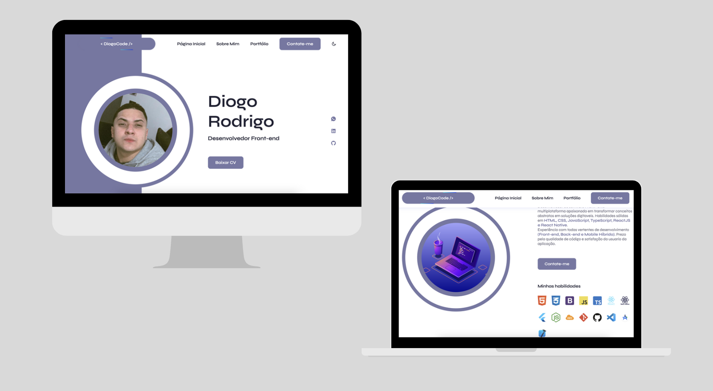
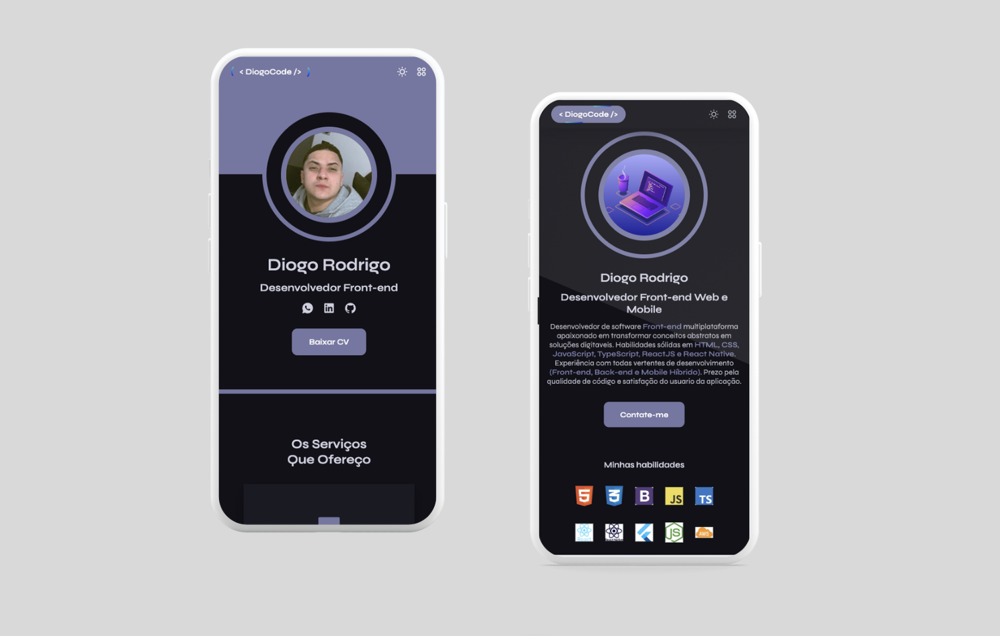

## 🚨 Personal Portfolio Website Project

This project is a personal portfolio website developed to showcase my skills, experiences, and work in a professional and attractive manner. Below are the main features and functionalities of the site:

#### 🚀 Navigation Structure

- **Home Page:**

  - Introduction with a brief presentation and a featured image.
  - Intuitive navigation to other sections of the site.

- **About Me:**

  - Detailed section with personal information, academic background, and professional experience.
  - Highlights of skills and interests.

- **Portfolio:**

  - Gallery of previous projects, with detailed descriptions and images.
  - Links to view the projects in action (if applicable).

- **Contact Me:**
  - Integrated contact form to facilitate communication.
  - Links to social media and other contact methods.

#### ⛏️ Additional Features

- **Dark and Light Theme:**

  - The site includes the option to switch between dark and light themes, providing a better user experience based on individual preferences and lighting conditions.

- **Email Sending:**
  - The contact section allows for direct email sending through the site, making it easier to communicate with potential clients or employers.

#### 👨🏻‍💻 Development Methodology

- **Mobile First:**
  - The site was developed following the Mobile First methodology, ensuring that the initial experience is optimized for mobile devices.
  - Subsequently, the design was adapted for desktops, ensuring compatibility and usability across all platforms.

#### 📲 Compatibility and User Interface

- **Mobile Device Compatibility:**
  - The site is fully responsive, perfectly adapting to any mobile device, whether a smartphone or tablet.

## 💡Technologies Used

- [**HTML**](https://developer.mozilla.org/pt-BR/docs/Web/HTML)
- [**CSS**](https://developer.mozilla.org/en-US/docs/Web/CSS)
- [**JavaScript**](https://developer.mozilla.org/en-US/docsWebJavaScript)
- [**REMIX ICON**](https://remixicon.com/)
- [**EmailJs**](https://www.emailjs.com/)

#

This personal portfolio website was created to professionally and impactfully highlight my qualifications, with a focus on usability and accessibility. With a well-defined structure, modern functionalities, and an adaptable design, it is the perfect tool to promote my personal brand and attract new professional opportunities.

## Prototype

